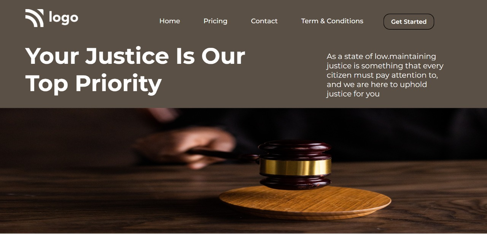

# Project-03-  Live Justice Template 
 ## Hey there ,  I am Amarjeet Kumar
 I have build a template of HTML and CSS project using my core css skills 
 
 
 
 

 My Live Deployed Website Link :- [Click here !](https://project-03-live-justice-template.netlify.app/)

 ## Here You can see a screeshot of my project.
 

 ## What I have learned in this project .
 - In this project i have learned alout about image adjustment on web page and how I move my image on web page .
-  In this project I learned about hover effects.

### To complete this project ready I spend allmost 4 hour on it.
